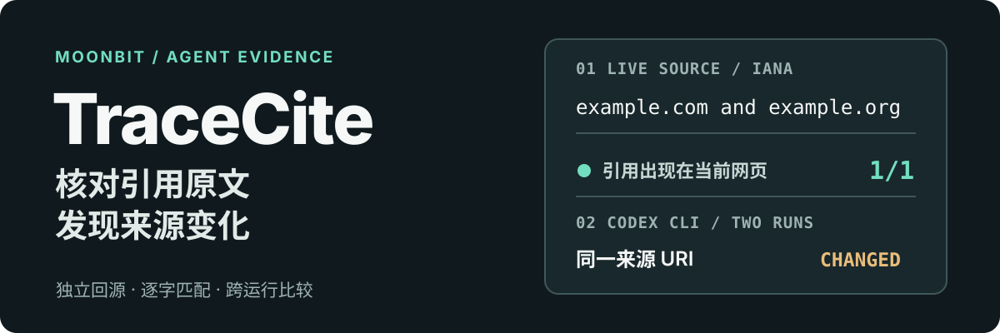

<p align="center">
  
</p>

# TraceCite

**用 MoonBit 核对 AI Agent 的引用，并发现来源内容何时改变。** 给出一段引用和 URL，TraceCite 会重新读取当前网页，检查引用片段是否出现在页面可见文本中；对本地文件和 Agent 轨迹，它还能回读来源并比较两次运行。适合在 RAG、网页研究或 Agent 工作流的交付前运行。

## 已验证的结果

以下输出来自仓库里的可复现样例。第一个命令实际请求 [IANA 示例域名页面](https://www.iana.org/help/example-domains)；第二个命令比较两次实际执行的 Codex CLI 轨迹。两次运行之间，开发者修改了同一测试文件的内容。

```text
$ moon run cmd/main verify-notes fixtures/simple-citation.md
PASS: 1/1 quotes appear in live web sources
  line 1 PASS https://www.iana.org/help/example-domains

$ moon run cmd/main compare fixtures/codex-two-run-before.jsonl fixtures/codex-two-run-after.jsonl
1 source changes; 0 unchanged
  [changed] file:fixtures/codex-live-run-source.txt
```

来源变化是刻意构造的测试值；第二个命令检测到变化时返回退出码 2，便于 CI 标记需要重审的回答。[查看脱敏事件与复现过程](docs/live-validation.md)。

## 三行输入，验证一条网页引用

项目要求 `moonc >= 0.10.14`。macOS/Linux 可用 [MoonBit 官方安装脚本](https://docs.moonbitlang.com/en/stable/tutorial/tour.html#installation)安装；Windows 安装方式见同一文档。

```sh
curl -fsSL https://cli.moonbitlang.com/install/unix.sh | bash
```

安装后重新打开终端，让 `moon` 和 `moonc` 进入 `PATH`，再获取仓库并安装依赖：

```sh
git clone https://github.com/Freakz2z/tracecite.git
cd tracecite
moon update
moonc -v
```

在仓库根目录运行下面的样例。不需要 JSONL 或适配器。

```text
claim: IANA lists example.com and example.org as documentation examples.
quote: example.com and example.org are maintained for documentation purposes.
url: https://www.iana.org/help/example-domains
```

```sh
moon run cmd/main verify-notes fixtures/simple-citation.md
```

把这三行保存为自己的笔记文件后，传给 `verify-notes` 即可；多条记录用空行或 `---` 分隔。命令支持 `--json` 输出。[完整输入约定](docs/contract.md)。

## 已有 Agent 轨迹怎么接入

- **网页来源**：`verify-urls <trace.jsonl>` 先核对轨迹中的调用、来源和引用，再重新请求 URL，检查当前页面是否仍含引用片段。
- **本地文件**：`verify-files <trace.jsonl>` 回读 `file:` 来源，发现捕获内容与当前文件不一致。
- **两次运行**：`compare <before.jsonl> <after.jsonl>` 按稳定来源 URI 报告新增、删除和内容变化。

仓库提供 [Codex CLI 适配器](adapters/codex_cli.py)及其[真实运行样例](docs/live-validation.md)。其他 Agent 可以生成同一 [JSONL 约定](docs/contract.md)；MoonBit 核心库支持 native、JS 和 Wasm，联网 CLI 在 native 目标运行。

根目录的 MoonBit 文件实现解析、证据验证与来源比较；`cmd/main/` 提供联网命令行，`adapters/` 是可选的 Codex CLI 导出器，`fixtures/` 保留可复现样例。

## 校验边界

TraceCite 确认的是**引用片段在检查时出现在独立读取的来源中**。它不判断整条 claim 的语义真假，也不能证明网页在 Agent 原始运行时的内容。跨运行比较需要稳定来源 URI。

HTTP 回源只接受默认端口的 HTTP/HTTPS URL，最多跟随五次重定向；单个来源限制为 20 秒和 2 MiB。当前网络库在连接时重新解析域名，因而不适合作为处理攻击者可控 URL 的服务端网络隔离层。地址筛选与内容类型规则见[输入约定](docs/contract.md)。

## 开发与许可

```sh
moon info
moon fmt
moon check --deny-warn
moon build --deny-warn
moon test --deny-warn
moon test --target js --deny-warn
moon test --target wasm --deny-warn
sh scripts/smoke.sh
python3 -m unittest discover -s adapters -p 'test_*.py'
```

项目使用 [Apache-2.0 许可证](LICENSE)，HTML 解析依赖 `bobzhang/html_parser`（Apache-2.0）。Mooncakes 包尚未发布。
