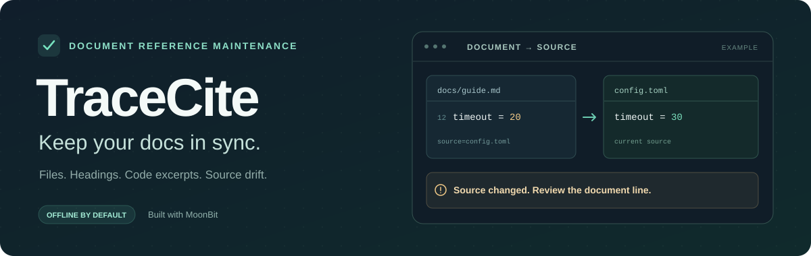

<p align="center">
  
</p>

<p align="center">
  <a href="https://github.com/Freakz2z/tracecite/actions/workflows/ci.yml"></a>
  
  
  <a href="LICENSE"></a>
</p>

# TraceCite

**让文档里的引用，跟上来源的变化。**

用 MoonBit 检查 Markdown 中的本地文件、标题锚点、源码片段与网页引文。保存引用快照后，来源变化会定位到需要重新审阅的文档行。一份项目配置，让本地与 CI 使用同一套规则。

<p>
  <a href="#快速开始">快速开始</a> ·
  <a href="docs/maintenance.md">维护指南</a> ·
  <a href="#github-action">GitHub Action</a> ·
  <a href="docs/publishing.md">Mooncakes 接入</a> ·
  <a href="docs/contract.md">输入约定</a>
</p>

> **版本说明**：**0.5.0** 提供项目配置、`init` 与 `check` 文档维护入口。Mooncakes 安装请指定 `@0.5.0`；GitHub 的旧 `v0.4.0` 不包含这些入口。

## 为什么需要 TraceCite

代码和配置更新了，README 中复制的片段却还停在旧版本；文件迁移、标题改名后，文档链接可能失效；网页仍能打开，引用的原文却已经改变。维护者需要知道具体哪份文档、哪一行需要复核。

TraceCite 把引用当作文档依赖，直接读取 Markdown 与来源。**本地检查默认离线**，无需模型 API、Agent 事件导出、数据库或后台服务；明确添加 `--online` 才访问网页。

## 能做什么

| 检查对象 | 使用方式 | 发现的问题 |
| --- | --- | --- |
| 本地文件与目录 | 普通链接、引用式链接、图片或 HTML 链接 | 来源被删除、迁移或超出工作区 |
| 标题与来源范围 | 标题锚点、`#L10-L20`、`#region:name` | 标题改名、行范围或命名区域失效 |
| 源码与配置片段 | 代码围栏添加 `source=路径` | 文档片段与当前来源不一致 |
| 逐字引文 | 双引号引文配来源链接或显式引用块 | 引文不在当前来源中；网页需 `--online` |
| 引用快照 | `--snapshot` 保存，`--baseline` 复查 | 来源区域或引用上下文改变，新增引用待复核 |
| 项目配置 | `init` 建立配置与基线，之后只运行 `check` | 本地与 CI 复用文档范围、排除项与检查规则 |
| CI 检查 | GitHub Action 或 `--github` | 以退出码和文件行号提示文档作者 |

## 快速开始

### 1. 获取源码并检查仓库文档

安装 [MoonBit](https://docs.moonbitlang.com/en/stable/tutorial/tour.html#installation)（`moonc >= 0.10.14`），然后执行：

```sh
git clone https://github.com/Freakz2z/tracecite.git
cd tracecite
moon update
moon run cmd/main check
```

### 2. 接入自己的项目

选择需要长期维护的文件或目录，初始化一次：

```sh
moon run cmd/main init docs README.md --root /path/to/your/repository
```

来源检查通过后，会生成 `tracecite.json` 和 `.tracecite-docs.json`。将它们一起提交到项目。之后无需重复填写扫描范围与基线：

```sh
moon run cmd/main check --root /path/to/your/repository
```

**默认严格、离线检查。** 已有配置或基线时，`init` 会停止；检查失败时不会创建它们。`--root` 定义工作区边界，配置路径相对根目录，引用来源相对文档所在目录。

需要回访网页来源时，在配置中设置 `online: true`，或临时添加 `--online`。配置字段与覆盖规则见 [维护指南](docs/maintenance.md#项目配置本地与-ci-用同一套规则)。

### 3. 构建独立可执行文件

```sh
bash scripts/package.sh
./_build/native/release/build/cmd/main/main.exe check
```

打包脚本在 `dist/` 生成本机压缩包。**运行独立 native 二进制无需安装 MoonBit、Python 或 Node。** [打包工作流](.github/workflows/binaries.yml)支持手动触发或版本标签触发，构建 Linux/macOS 包。

包内保留第三方许可与构建清单；联网 HTTPS 检查使用系统 TLS 库和证书。打包与演示脚本使用 Python 3，它仅是开发工具。

### 4. 运行完整维护演示

```sh
python3 scripts/acceptance_demo.py
```

[13 步离线案例](examples/maintenance/README.md)展示来源变更后检查失败、定位文档行、修正片段与锚点、复核并更新基线、恢复通过。每一步保存 JSON 报告；案例在复制的临时项目中运行。
这是受控功能演示，实际公开资料中发现的引文问题见 [外部审计记录](docs/external-audit.md)。

## 绑定源码片段

在代码围栏的语言后添加 `source=路径`。本 README 中的这段代码已绑定 [moon.mod](moon.mod)：

```text source=moon.mod
preferred_target = "native"
```

它的 Markdown 写法是：

````markdown
```text source=moon.mod
preferred_target = "native"
```
````

片段按完整行比较，保留引号、标点和缩进，只统一 CRLF/LF 换行。默认在整个来源文件中寻找片段，来源前面增加几行不会使仍然存在的片段失效。

行范围、命名区域、空格路径与本地逐字引文的写法见 [维护指南](docs/maintenance.md)。

## 保存与复核引用快照

`init` 已完成首次记录；以后按项目配置复查：

```sh
moon run cmd/main check
```

**来源改变后**：查看输出中的文档行号与前后内容，决定文档是否需要修改。完成复核后，更新配置所维护的完整范围：

```sh
moon run cmd/main check --snapshot .tracecite-docs.json
moon run cmd/main check
```

`--snapshot` 会忽略配置中的旧基线，但仍独立检查来源；显式同时传入 `--baseline` 时继续比较旧基线，发生变化便拒绝写入。

- 快照使用相对文档路径；移动文档段落不会改变引用身份。
- 引用不匹配或来源区域改变时，输出文档行号、候选片段或前后观察值；新增引用提示复核。
- 检查失败或存在待复核项时，不写快照，也不自动覆盖旧基线。
- 离线快照仅覆盖实际检查的本地引用；网页引文在保存与复查时都需要 `--online`。

## GitHub Action

将项目配置和快照提交到仓库，再添加以下工作流步骤；无需重复填写规则。示例跟随 `main`，正式使用应固定到审核过的提交 SHA：

```yaml
- uses: actions/checkout@v5
- uses: Freakz2z/tracecite@main
```

Action 安装并编译 MoonBit，在调用方仓库中解析引用，失败时产生文件行号诊断。建议设置 `permissions: contents: read`。

| 输入 | 默认值 | 说明 |
| --- | --- | --- |
| `config` | 自动读取 `tracecite.json` | 指定其他项目配置，路径相对调用方根目录 |
| `path` | 配置中的 `paths`；无配置为 `.` | 指定时覆盖扫描范围 |
| `strict` | 配置值；无配置为 `true` | 显式 `true` / `false` 覆盖规则 |
| `online` | 配置值；无配置为 `false` | 显式 `true` / `false` 覆盖规则 |
| `baseline` | 配置值 | 指定时覆盖引用快照路径 |
| `exclude` | 配置值 | 追加排除路径，每行一个 |

旧的 `report:` 输入仍兼容，会跳过项目配置、覆盖 `path` 并启用联网检查。完整定义见 [action.yml](action.yml)。

## 检查结果与边界

默认的 `LOCAL_OK` 表示实际检查的本地引用通过。每次输出会列出检查数、失败数、待复核数、跳过的网页引用，以及没有 `source=` 的代码块数量。

| 退出码 | 含义 |
| --- | --- |
| `0` | 实际检查的引用通过；严格模式下没有待复核项 |
| `1` | 参数、输入读取或快照写入失败 |
| `2` | 引用失败、来源改变、没有可检查引用；严格模式下也包含待复核项 |

<details>
<summary><strong>支持范围与校验边界</strong></summary>

- 本地链接检查文件或目录是否存在；片段支持 ATX 标题、行范围与命名区域。Setext 标题、自定义 HTML ID 与站点特有锚点规则暂不解析。
- 行内引文支持中文弯双引号与英文直双引号；多行或来源关联不明确时，使用显式原文、来源块。
- 未绑定来源的代码块只计入覆盖摘要，不执行；未关联引文或无法解析的来源会提示复核，`--strict` 让这些提示导致失败。
- 网页引文只确认检查时可提取的原文是否存在，不判断论断的语义真假；动态页面、图片与登录墙可能需要人工复核。来源变化表示需要复核，不表示文档一定错误。
- 本地来源受 `--root` 边界限制，包括符号链接的真实目标；文档与来源正文上限为 2 MiB。网页回源限制默认端口、公开地址、重定向、20 秒超时与 2 MiB 响应。

详细约定见 [维护指南](docs/maintenance.md)和 [HTTP 回源行为](docs/contract.md#http-回源行为)。

</details>

<details>
<summary><strong>网络代理</strong></summary>

联网检查支持 `https_proxy` / `HTTPS_PROXY`、`http_proxy` / `HTTP_PROXY`，小写变量优先。代理地址支持不含用户名或密码的 HTTP/HTTPS URL，可使用私有地址与非默认端口。

`no_proxy` / `NO_PROXY` 支持逗号分隔的域名、可选端口与 `*`，域名匹配其自身及子域名。代理通过 CONNECT 转发；TLS 证书校验、来源地址筛选和重定向限制仍然生效。错误的代理配置不会自动退回直连。

</details>

## MoonBit 包接入与发布

核心库可在 MoonBit 项目中导入，支持 native、JS、Wasm；CLI 另提供独立 native 包。消费项目可执行：

```sh
moon add Freakz2z/tracecite@0.5.0
```

需要命令行时可安装 `moon install Freakz2z/tracecite/cmd/tracecite@0.5.0`，以后直接运行 `tracecite init` 和 `tracecite check`。

维护者使用 `bash scripts/release.sh` 生成并验证源码包，包含解包后的文档检查和三个目标的消费项目测试。准备完成且登录有发布权限的 Mooncakes 账户后，使用 `bash scripts/release.sh --publish` 上传并确认版本。具体步骤见 [发布与接入指南](docs/publishing.md)。

## 源码结构与最小示例

| 位置 | 职责 |
| --- | --- |
| 根包 .mbt 与 moon.pkg | MoonBit 核心：JSONL 解析/追溯、引文匹配、来源比较、Markdown 引用、配置与快照模型；支持 native/JS/Wasm |
| cli/ | MoonBit native 文件回读、网页与代理、文档扫描和命令实现 |
| cmd/main、cmd/tracecite | 共用 CLI 实现的源码运行入口与可安装入口 |
| *_wbtest.mbt、scripts/、adapters/ | 核心与 I/O 测试、开发打包工具、可选 Agent 事件适配器 |
| examples/、fixtures/、docs/ | 可运行示例、脱敏测试输入与使用/验收说明 |

安装源码依赖后，从仓库根目录执行一个最小离线检查：

```sh
moon update
moon run cmd/main check guide.md --root examples/maintenance/project --no-config --strict
```

预期输出 LOCAL_OK 并退出 0，直接检查样例中的本地标题链接、配置片段和逐字引文。
它不修改样例；完整的来源变更与修复流程由 acceptance_demo.py 演示。
文末的成果与验收说明逐项对应 9 条验收要求，并提供核心测试路径与固定 CI 证据。

## 开发与验证

核心库支持 **native、JS 与 Wasm**；文件与联网 CLI 使用 **native**。项目的 [模块配置](moon.mod)只声明异步 I/O 与 HTML 解析两个外部 MoonBit 库。

```sh
moon info
moon fmt
moon check --deny-warn
moon test --deny-warn
moon test --target js --deny-warn
moon test --target wasm --deny-warn
python3 scripts/test_document_cli.py
python3 -m unittest discover -s adapters -p 'test_*.py'
sh scripts/smoke.sh
```

Python 仅用于开发测试和可选的旧 Agent 适配器。JSONL 校验、`verify-files`、`verify-urls`、`verify-notes`、`check-report` 与 `compare` 继续兼容，见 [原有输入约定](docs/contract.md)。

## 项目资料

| 资料 | 内容 |
| --- | --- |
| [文档引用维护指南](docs/maintenance.md) | 片段绑定、标题锚点、引文与快照的完整用法 |
| [Mooncakes 发布与接入](docs/publishing.md) | 源码包验证、公开 API 接入与发布步骤 |
| [输入约定](docs/contract.md) | 兼容接口、输入格式与 HTTP 回源规则 |
| [第三方资料审计](docs/external-audit.md) | 网页逐字引文的固定样本、结果与局限 |
| [普通报告试验](examples/field-trial/README.md) | 普通 Markdown 报告的核验记录 |
| [离线维护演示](examples/maintenance/README.md) | 13 步维护闭环、退出码与 JSON 证据 |
| [成果与验收说明](docs/acceptance.md) | 原申报方向、四项验收依据、固定发布身份与验证方法 |
| [版本记录](CHANGELOG.md) | 已发布版本与后续仓库改动 |
| [第三方许可通知](THIRD_PARTY_NOTICES.md) | 依赖、标准库及 native 运行时的许可与来源 |
| [Mooncakes 模块](https://mooncakes.io/docs/Freakz2z/tracecite) | 平台上的已发布版本 |

验证记录用于说明可执行能力，不代表用户采用率或审核工时收益。

使用 [Apache-2.0 许可证](LICENSE)。第三方组件保留各自许可和上游通知，详见 [许可清单](THIRD_PARTY_NOTICES.md)。新增验收与许可打包材料属于仓库未发布改动，尚未进入既有 0.5.0 Mooncakes 包。
